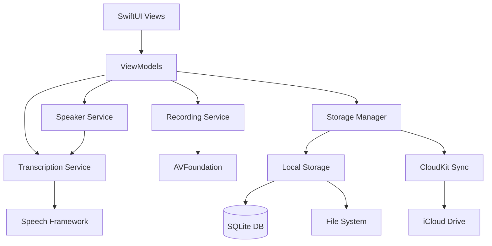

# Parley Agent Instructions

This document provides comprehensive guidance for agents working with the Parley iOS meeting recorder app codebase. It combines best practices, architectural patterns, and project-specific conventions.

## Table of Contents

1. [Project Overview](#project-overview)
2. [Architecture](#architecture)
3. [Build and Test Commands](#build-and-test-commands)
4. [Service Layer](#service-layer)
5. [Data Flow](#data-flow)
6. [Key Models](#key-models)
7. [Error Handling](#error-handling)
8. [File Organization](#file-organization)
9. [Development Best Practices](#development-best-practices)
10. [Apple iOS and Swift Best Practices](#apple-ios-and-swift-best-practices)
11. [Testing Strategy](#testing-strategy)
12. [Permissions and Security](#permissions-and-security)

## Project Overview

Parley is an iOS meeting recorder app with real-time transcription, speaker identification, and cloud synchronization. The app follows a clean architecture pattern with protocol-based services and SwiftUI for the UI.

### Key Features

- **Recording**: High-quality audio recording using AVFoundation
- **Transcription**: Real-time speech-to-text using Speech framework with Whisper API fallback
- **Speaker Identification**: Speaker diarization and voice profile management
- **Storage**: Local persistence with Core Data and iCloud synchronization using CloudKit
- **Export**: Multiple export formats (text, markdown, PDF, audio)
- **Playback**: Synchronized audio playback with transcript highlighting
- **Notes**: Time-stamped notes linked to recordings
- **Tags**: Categorization and organization system

## Architecture

### High-Level Architecture



### Layer Responsibilities

**Presentation Layer (SwiftUI)**
- User interface rendering and interaction
- State observation and updates via Combine
- Navigation and routing
- Input validation and user feedback

**Business Logic Layer (Services)**
- Recording orchestration and state management
- Transcription processing and speaker detection
- Storage operations and sync coordination
- Business rule enforcement

**Data Layer**
- Local database operations (SQLite/Core Data)
- File system management
- iCloud synchronization
- Data model persistence

**Platform Layer (Apple Frameworks)**
- Audio capture (AVFoundation)
- Speech recognition (Speech Framework)
- Cloud storage (CloudKit)
- Background task execution

## Build and Test Commands

### Building

Use the xcode-cli skill

### Testing

Use the xcode-cli skill
```

## Service Layer

The app uses a protocol-driven architecture where all core services are defined as protocols and implemented separately:

### RecordingService
- Audio recording with AVFoundation
- Manages recording lifecycle (start, pause, resume, stop)
- Configures audio session and quality settings
- Monitors audio levels and provides real-time feedback
- Handles background recording continuation

### TranscriptionService
- Speech-to-text using Speech framework and Whisper API fallback
- Real-time streaming transcription results
- Marks low-confidence segments
- Generates timestamps for transcript segments
- Handles transcription errors and fallbacks

### SpeakerService
- Speaker diarization and voice profile management
- Detects speaker changes in audio stream
- Assigns speaker identifiers to transcript segments
- Manages speaker profile creation and storage
- Allows post-recording speaker name assignment

### StorageManager
- Local persistence with Core Data
- Manages file system operations for audio files
- Coordinates iCloud synchronization
- Handles storage cleanup and quota management
- Provides query and search capabilities

### CloudSyncService
- iCloud synchronization using CloudKit
- Uploads recordings to iCloud Drive
- Downloads recordings from iCloud to local device
- Resolves sync conflicts
- Monitors sync status and connectivity
- Handles sync queue for offline scenarios

### ExportService
- Multiple export formats (text, markdown, PDF, audio)
- Generates plain text exports with transcript and timestamps
- Creates Markdown exports with formatted headings and speaker labels
- Copies audio files for sharing
- Manages temporary file cleanup

## Data Flow

1. **Recording**: `RecordingService` → `TranscriptionService` → `SpeakerService`
2. **Storage**: Services → `StorageManager` (Core Data) → `CloudSyncService` (iCloud)
3. **UI**: `ViewModels` coordinate between services and SwiftUI views

## Key Models

### Recording
- Core data model with audio file, transcript, speakers, metadata
- Contains: id, title, date, duration, audioFileURL, transcript, speakers, tags, notes, fileSize, isSynced, lastModified

### TranscriptSegment
- Time-stamped transcript chunks with speaker attribution
- Contains: id, text, timestamp, duration, confidence, speakerID, isEdited

### SpeakerProfile
- Voice profiles for automatic speaker recognition
- Contains: id, displayName, voiceCharacteristics, createdAt, lastUsed

### Note
- Time-stamped notes linked to recordings
- Contains: id, text, timestamp, createdAt

## Error Handling

Centralized error handling with:

### Custom Error Types
- `RecordingError`: microphonePermissionDenied, audioSessionConfigurationFailed, recordingInProgress, noActiveRecording, diskSpaceInsufficient, audioEngineFailure
- `TranscriptionError`: speechRecognitionUnavailable, speechRecognitionPermissionDenied, recognitionFailed, audioFormatUnsupported, recognitionLimitExceeded
- `StorageError`: recordingNotFound, fileOperationFailed, corruptedData, quotaExceeded
- `SyncError`: iCloudUnavailable, networkUnavailable, authenticationFailed, conflictDetected, uploadFailed

### Error Handling Components
- `ErrorLogger` for centralized logging using OSLog
- `errorAlert` view modifier for consistent UI error presentation
- Toast notifications for non-critical feedback

### Error Handling Strategy
- **User-Facing Errors**: Display clear, actionable error messages with recovery options
- **Recoverable Errors**: Implement automatic retry with exponential backoff and queue operations
- **Critical Errors**: Save recording data before crash and implement crash recovery
- **Error Logging**: Use OSLog for structured logging with context and privacy protection

## File Organization

```
Parley/
├── Models/                  # Data models and Core Data entities
├── Services/                # Protocol definitions and service implementations
├── Views/                   # SwiftUI views organized by feature
├── ViewModels/              # View models following MVVM pattern
├── Utilities/               # Error handling, UI helpers, Core Data utilities
└── Resources/               # Core Data model files and assets

ParleyTests/
├── Services/                # Unit tests for services
├── Integration/             # Integration tests
└── ViewModels/              # View model tests

ParleyUITests/               # UI tests
```

## Development Best Practices

### Code Quality
- Follow Swift API Design Guidelines
- Use protocol-oriented programming
- Implement proper separation of concerns
- Write comprehensive unit and integration tests
- Use Combine for reactive programming
- Implement proper memory management

### Testing
- Tests organized into unit tests, integration tests, and UI tests
- Unit tests focus on individual service functionality
- Integration tests cover end-to-end workflows
- UI tests verify user interface behavior
- Test coverage for all major features and edge cases

### Performance
- Optimize Core Data fetch requests
- Implement lazy loading for large datasets
- Use proper background threading
- Monitor memory usage and prevent leaks
- Profile with Instruments for performance optimization

### Accessibility
- Add VoiceOver labels to all interactive elements
- Ensure proper color contrast
- Support Dynamic Type
- Test with accessibility features enabled
- Follow WCAG AA standards

## Apple iOS and Swift Best Practices

### SwiftUI Best Practices
- Use `@State`, `@Binding`, `@ObservedObject`, `@StateObject` appropriately
- Implement proper view lifecycle management
- Use environment values for dependency injection
- Create reusable view components
- Implement proper accessibility modifiers

### AVFoundation Best Practices
- Configure audio sessions properly
- Handle audio interruptions gracefully
- Implement proper audio metering
- Use background audio capabilities
- Manage audio file storage efficiently

### Speech Framework Best Practices
- Request permissions with clear explanations
- Handle authorization changes
- Implement proper error handling
- Use on-device recognition when possible
- Handle recognition limits and timeouts

### Core Data Best Practices
- Use proper fetch request optimization
- Implement batch processing
- Use NSFetchedResultsController for efficient queries
- Handle merge conflicts properly
- Implement proper data validation

### CloudKit Best Practices
- Handle network connectivity changes
- Implement proper error handling
- Use background operations for sync
- Handle quota limitations
- Implement conflict resolution

### Combine Framework Best Practices
- Use proper memory management with cancellables
- Implement proper error handling in publishers
- Use appropriate schedulers
- Avoid retain cycles
- Implement proper resource cleanup

## Testing Strategy

### Unit Testing
- Test individual service functionality
- Verify state transitions and error handling
- Test data model validation
- Implement mock services for isolation

### Integration Testing
- Test end-to-end workflows
- Verify service interactions
- Test data flow through the system
- Implement realistic test scenarios

### UI Testing
- Test user interface interactions
- Verify navigation flows
- Test accessibility features
- Implement performance testing

### Test Coverage Goals
- 80%+ unit test coverage for services
- Comprehensive integration test coverage
- UI test coverage for major user flows
- Performance testing for critical operations

## Permissions and Security

### Required Permissions
- Microphone access (`NSMicrophoneUsageDescription`)
- Speech recognition (`NSSpeechRecognitionUsageDescription`)
- iCloud entitlements for sync

### Permission Handling
- Request permissions with clear explanations
- Handle denied permissions gracefully
- Provide settings deep-link for permission changes
- Test permission flows thoroughly

### Data Protection
- Enable Data Protection for sensitive data
- Use proper file protection levels
- Implement secure data storage
- Handle sensitive data appropriately

### Privacy Considerations
- No analytics without explicit consent
- No third-party data sharing
- Clear privacy policy
- Proper data deletion capabilities

## Additional Resources

- [Design Document](.kiro/specs/meeting-recorder-mvp/design.md)
- [Requirements Document](.kiro/specs/meeting-recorder-mvp/requirements.md)
- [Implementation Tasks](.kiro/specs/meeting-recorder-mvp/tasks.md)
- [Vision Document](meeting_recorder_vision.md)

**CONFIRM** by stating: `[I read the Agent Instructions]`