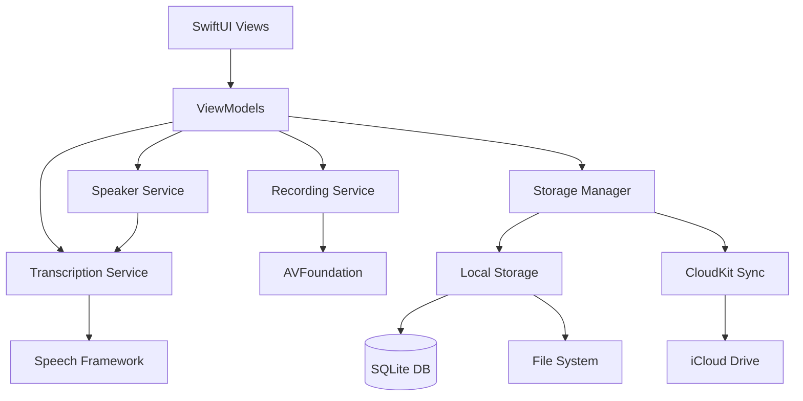

# Design Document - Meeting Recorder MVP

## Overview

The Meeting Recorder MVP is an iOS application built using SwiftUI and native Apple frameworks. The architecture follows a clean, modular design with clear separation between audio capture, transcription, storage, and UI layers. The app leverages AVFoundation for audio recording, Speech Framework for real-time transcription, and CloudKit for iCloud synchronization.

The design prioritizes offline-first functionality with background sync, ensuring users can record and access content regardless of network connectivity. All processing happens on-device to maintain privacy and minimize latency.

## Architecture

### High-Level Architecture



### Layer Responsibilities

**Presentation Layer (SwiftUI)**
- User interface rendering and interaction
- State observation and updates via Combine
- Navigation and routing
- Input validation and user feedback

**Business Logic Layer (Services)**
- Recording orchestration and state management
- Transcription processing and speaker detection
- Storage operations and sync coordination
- Business rule enforcement

**Data Layer**
- Local database operations (SQLite/Core Data)
- File system management
- iCloud synchronization
- Data model persistence

**Platform Layer (Apple Frameworks)**
- Audio capture (AVFoundation)
- Speech recognition (Speech Framework)
- Cloud storage (CloudKit)
- Background task execution

## Components and Interfaces

### 1. Recording Service

**Responsibilities:**
- Manage audio recording lifecycle (start, pause, resume, stop)
- Configure audio session and quality settings
- Monitor audio levels and provide real-time feedback
- Handle background recording continuation
- Coordinate with Transcription Service for real-time processing

**Key Interfaces:**

```swift
protocol RecordingServiceProtocol {
    var recordingState: Published<RecordingState>.Publisher { get }
    var audioLevel: Published<Float>.Publisher { get }
    var duration: Published<TimeInterval>.Publisher { get }
    
    func startRecording(quality: AudioQuality) async throws -> RecordingSession
    func pauseRecording() async throws
    func resumeRecording() async throws
    func stopRecording() async throws -> Recording
    func cancelRecording() async throws
}

enum RecordingState {
    case idle
    case recording
    case paused
    case processing
}

enum AudioQuality {
    case low      // 64 kbps
    case medium   // 128 kbps
    case high     // 256 kbps
}
```

**Implementation Details:**
- Uses AVAudioRecorder for audio capture
- Configures AVAudioSession with `.record` category and `.allowBluetooth` options
- Implements audio metering for level indicators (updateMeters() at 60Hz)
- Maintains recording buffer in memory for real-time transcription feed
- Handles interruptions (phone calls, alarms) with proper session restoration
- Writes audio to temporary file during recording, moves to permanent location on stop

### 2. Transcription Service

**Responsibilities:**
- Convert audio to text using Speech Framework
- Provide real-time streaming transcription results
- Mark low-confidence segments
- Generate timestamps for transcript segments
- Handle transcription errors and fallbacks

**Key Interfaces:**

```swift
protocol TranscriptionServiceProtocol {
    var transcriptSegments: Published<[TranscriptSegment]>.Publisher { get }
    
    func startTranscription(audioURL: URL) async throws
    func startLiveTranscription(audioBuffer: AVAudioPCMBuffer) async throws
    func stopTranscription() async
    func getFullTranscript() async -> [TranscriptSegment]
}

struct TranscriptSegment: Identifiable, Codable {
    let id: UUID
    let text: String
    let timestamp: TimeInterval
    let duration: TimeInterval
    let confidence: Float
    let speakerID: String
    var isEdited: Bool
}
```

**Implementation Details:**
- Uses SFSpeechRecognizer for on-device recognition
- Requests authorization on first use
- Processes audio in real-time using SFSpeechAudioBufferRecognitionRequest
- Buffers partial results and publishes final segments
- Applies confidence threshold of 0.5 for low-confidence marking
- Handles recognition limits (1 minute segments, reconnects as needed)
- Falls back gracefully if Speech Framework unavailable

### 3. Speaker Service

**Responsibilities:**
- Detect speaker changes in audio stream
- Assign speaker identifiers to transcript segments
- Manage speaker profile creation and storage
- Allow post-recording speaker name assignment

**Key Interfaces:**

```swift
protocol SpeakerServiceProtocol {
    func detectSpeakers(audioURL: URL) async throws -> [SpeakerSegment]
    func assignSpeakerToSegment(segmentID: UUID, speakerID: String) async throws
    func updateSpeakerName(speakerID: String, name: String) async throws
    func getSpeakerProfile(speakerID: String) async -> SpeakerProfile?
}

struct SpeakerSegment {
    let speakerID: String
    let startTime: TimeInterval
    let endTime: TimeInterval
}

struct SpeakerProfile: Identifiable, Codable {
    let id: String
    var displayName: String
    let voiceCharacteristics: Data  // Acoustic features
    let createdAt: Date
    var lastUsed: Date
}
```

**Implementation Details:**
- Uses basic energy-based voice activity detection (VAD)
- Implements simple speaker change detection based on audio characteristics
- Assigns sequential speaker IDs (Speaker 1, Speaker 2, etc.)
- Stores speaker profiles locally in Core Data
- MVP uses simplified diarization (energy levels, pause detection)
- Future enhancement: ML-based speaker embedding models

### 4. Storage Manager

**Responsibilities:**
- Persist recordings, transcripts, and metadata locally
- Manage file system operations for audio files
- Coordinate iCloud synchronization
- Handle storage cleanup and quota management
- Provide query and search capabilities

**Key Interfaces:**

```swift
protocol StorageManagerProtocol {
    func saveRecording(_ recording: Recording) async throws
    func getRecording(id: UUID) async throws -> Recording?
    func getAllRecordings(sortedBy: SortOption) async throws -> [Recording]
    func updateRecording(_ recording: Recording) async throws
    func deleteRecording(id: UUID, deleteFromCloud: Bool) async throws
    func searchRecordings(query: String) async throws -> [Recording]
    func getStorageUsage() async -> StorageUsage
    func syncToCloud() async throws
}

struct Recording: Identifiable, Codable {
    let id: UUID
    var title: String
    let date: Date
    let duration: TimeInterval
    let audioFileURL: URL
    var transcript: [TranscriptSegment]
    var speakers: [SpeakerProfile]
    var tags: [String]
    var notes: [Note]
    let fileSize: Int64
    var isSynced: Bool
    var lastModified: Date
}

struct Note: Identifiable, Codable {
    let id: UUID
    var text: String
    let timestamp: TimeInterval?
    let createdAt: Date
}
```

**Implementation Details:**
- Uses Core Data for metadata and searchable content
- Stores audio files in app's Documents directory
- Implements full-text search using Core Data NSPredicate
- Uses NSFileCoordinator for iCloud file coordination
- Monitors iCloud availability with NSUbiquitousKeyValueStore
- Implements background URLSession for reliable cloud uploads
- Maintains sync queue for offline operations
- Uses NSMetadataQuery to track iCloud sync status

### 5. Cloud Sync Service

**Responsibilities:**
- Upload recordings to iCloud Drive
- Download recordings from iCloud to local device
- Resolve sync conflicts
- Monitor sync status and connectivity
- Handle sync queue for offline scenarios

**Key Interfaces:**

```swift
protocol CloudSyncServiceProtocol {
    var syncStatus: Published<SyncStatus>.Publisher { get }
    
    func enableSync() async throws
    func disableSync() async throws
    func syncRecording(id: UUID) async throws
    func syncAll() async throws
    func resolveSyncConflict(id: UUID, resolution: ConflictResolution) async throws
}

enum SyncStatus {
    case idle
    case syncing(progress: Double)
    case synced
    case error(Error)
    case offline
}

enum ConflictResolution {
    case keepLocal
    case keepCloud
    case keepBoth
}
```

**Implementation Details:**
- Uses CloudKit container for metadata sync
- Uses iCloud Drive (NSFileManager.ubiquityContainerURL) for audio files
- Implements conflict resolution based on lastModified timestamps
- Queues sync operations when offline, processes when online
- Uses CKRecord for structured metadata storage
- Implements exponential backoff for failed sync attempts

## Data Models

### Core Data Schema

**RecordingEntity**
```swift
@Entity
class RecordingEntity: NSManagedObject {
    @NSManaged var id: UUID
    @NSManaged var title: String
    @NSManaged var date: Date
    @NSManaged var duration: Double
    @NSManaged var audioFileName: String
    @NSManaged var transcriptData: Data  // JSON encoded
    @NSManaged var speakersData: Data    // JSON encoded
    @NSManaged var tagsData: Data        // JSON encoded
    @NSManaged var notesData: Data       // JSON encoded
    @NSManaged var fileSize: Int64
    @NSManaged var isSynced: Bool
    @NSManaged var lastModified: Date
    @NSManaged var searchableContent: String  // For full-text search
}
```

**SpeakerProfileEntity**
```swift
@Entity
class SpeakerProfileEntity: NSManagedObject {
    @NSManaged var id: String
    @NSManaged var displayName: String
    @NSManaged var voiceCharacteristics: Data
    @NSManaged var createdAt: Date
    @NSManaged var lastUsed: Date
}
```

### File System Structure

```
Documents/
├── Recordings/
│   ├── {recording-uuid}/
│   │   ├── audio.m4a
│   │   ├── transcript.json
│   │   └── metadata.json
│   └── {recording-uuid}/
│       └── ...
└── SpeakerProfiles/
    └── profiles.json

iCloud Drive/
└── MeetingRecorder/
    └── Recordings/
        └── {recording-uuid}/
            ├── audio.m4a
            ├── transcript.json
            └── metadata.json
```

### JSON Schemas

**transcript.json**
```json
{
  "version": "1.0",
  "segments": [
    {
      "id": "uuid",
      "text": "Hello everyone",
      "timestamp": 0.0,
      "duration": 1.5,
      "confidence": 0.95,
      "speakerID": "speaker-1",
      "isEdited": false
    }
  ]
}
```

**metadata.json**
```json
{
  "id": "uuid",
  "title": "Team Standup",
  "date": "2025-11-16T10:00:00Z",
  "duration": 1800.0,
  "fileSize": 15728640,
  "tags": ["standup", "team-alpha"],
  "speakers": [
    {
      "id": "speaker-1",
      "displayName": "John Doe"
    }
  ],
  "notes": [
    {
      "id": "uuid",
      "text": "Action item: Review PR #123",
      "timestamp": 450.0,
      "createdAt": "2025-11-16T10:07:30Z"
    }
  ],
  "lastModified": "2025-11-16T10:30:00Z"
}
```

## Error Handling

### Error Categories

**Recording Errors**
```swift
enum RecordingError: LocalizedError {
    case microphonePermissionDenied
    case audioSessionConfigurationFailed
    case recordingInProgress
    case noActiveRecording
    case diskSpaceInsufficient
    case audioEngineFailure
    
    var errorDescription: String? {
        switch self {
        case .microphonePermissionDenied:
            return "Microphone access is required to record audio"
        case .diskSpaceInsufficient:
            return "Not enough storage space available"
        // ... other cases
        }
    }
}
```

**Transcription Errors**
```swift
enum TranscriptionError: LocalizedError {
    case speechRecognitionUnavailable
    case speechRecognitionPermissionDenied
    case recognitionFailed(underlying: Error)
    case audioFormatUnsupported
    case recognitionLimitExceeded
}
```

**Storage Errors**
```swift
enum StorageError: LocalizedError {
    case recordingNotFound
    case fileOperationFailed(underlying: Error)
    case corruptedData
    case quotaExceeded
}
```

**Sync Errors**
```swift
enum SyncError: LocalizedError {
    case iCloudUnavailable
    case networkUnavailable
    case authenticationFailed
    case conflictDetected
    case uploadFailed(underlying: Error)
}
```

### Error Handling Strategy

**User-Facing Errors:**
- Display clear, actionable error messages
- Provide recovery options (retry, settings, cancel)
- Log errors for debugging without exposing technical details

**Recoverable Errors:**
- Implement automatic retry with exponential backoff
- Queue operations for later execution
- Maintain app state consistency

**Critical Errors:**
- Save recording data before crash
- Implement crash recovery on next launch
- Preserve user data integrity

**Error Logging:**
- Use OSLog for structured logging
- Include context (user action, app state, error details)
- Respect user privacy (no PII in logs)

## Testing Strategy

### Unit Testing

**Recording Service Tests:**
- Test recording state transitions
- Verify audio quality configuration
- Test pause/resume functionality
- Verify duration tracking accuracy
- Test background recording continuation

**Transcription Service Tests:**
- Test transcript segment creation
- Verify timestamp accuracy
- Test confidence scoring
- Test error handling for unavailable Speech Framework

**Speaker Service Tests:**
- Test speaker detection logic
- Verify speaker ID assignment
- Test speaker profile management
- Test name assignment functionality

**Storage Manager Tests:**
- Test CRUD operations for recordings
- Verify search functionality
- Test storage usage calculations
- Test deletion with cloud sync options

**Cloud Sync Service Tests:**
- Test sync queue management
- Verify conflict resolution logic
- Test offline operation queuing
- Test sync status updates

### Integration Testing

**Recording Flow:**
- Start recording → transcribe → detect speakers → save → sync
- Test pause/resume with transcription continuity
- Test background recording with app state changes

**Playback Flow:**
- Load recording → play audio → sync transcript highlighting
- Test seeking to transcript segment
- Test playback controls

**Export Flow:**
- Load recording → generate export format → share
- Test all export formats (TXT, MD, M4A)
- Verify exported content accuracy

### UI Testing

**Recording Screen:**
- Test record button interaction
- Verify real-time transcription display
- Test audio level visualization
- Test pause/resume buttons

**Recording List:**
- Test list scrolling and performance
- Test search functionality
- Test filtering by tags and date
- Test recording selection and navigation

**Recording Detail:**
- Test playback controls
- Test transcript editing
- Test note addition
- Test export options

### Performance Testing

**Metrics to Monitor:**
- Recording start latency (target: < 2 seconds)
- Transcription delay (target: < 3 seconds)
- UI responsiveness during recording (target: 60 FPS)
- Memory usage during long recordings (target: < 200 MB)
- Battery consumption (target: < 10% per hour of recording)
- Storage efficiency (audio compression ratio)

**Load Testing:**
- Test with 100+ recordings in library
- Test with 2-hour continuous recording
- Test with multiple simultaneous operations (record + sync)
- Test with low storage scenarios

### Accessibility Testing

**VoiceOver Support:**
- All interactive elements have labels
- Recording state announced clearly
- Transcript content accessible
- Playback controls accessible

**Dynamic Type:**
- UI scales with system font size
- Transcript remains readable at all sizes
- Buttons remain tappable at all sizes

**Color Contrast:**
- Meets WCAG AA standards
- Recording indicators visible in all modes
- Dark mode support

## Security and Privacy

### Permissions

**Required Permissions:**
- Microphone access (NSMicrophoneUsageDescription)
- Speech recognition (NSSpeechRecognitionUsageDescription)
- iCloud capability (com.apple.developer.icloud-container-identifiers)

**Permission Handling:**
- Request permissions with clear explanations
- Handle denied permissions gracefully
- Provide settings deep-link for permission changes

### Data Protection

**Local Storage:**
- Enable Data Protection (NSFileProtectionComplete)
- Encrypt sensitive metadata in Core Data
- Use Keychain for user preferences

**Cloud Storage:**
- Leverage iCloud's built-in encryption
- Ensure files marked for encryption
- Validate data integrity on download

**Privacy Considerations:**
- No analytics without explicit consent
- No third-party data sharing
- Voice profiles stored locally only
- Clear data deletion (right to erasure)

## Performance Optimizations

### Audio Processing

- Use hardware-accelerated audio encoding (AAC)
- Buffer audio in chunks for real-time transcription
- Implement audio level metering with minimal CPU impact
- Use background threads for file I/O operations

### Transcription

- Process audio in 1-minute segments to avoid Speech Framework limits
- Cache partial transcription results
- Use background queue for transcription processing
- Implement debouncing for UI updates (max 10 updates/second)

### Storage

- Lazy load transcript content for list views
- Implement pagination for large recording lists
- Use NSFetchedResultsController for efficient Core Data queries
- Index searchable content for fast full-text search

### UI Rendering

- Use LazyVStack for recording list
- Implement view recycling for transcript segments
- Debounce audio level updates to 60 FPS
- Use @Published sparingly to minimize SwiftUI updates

### Memory Management

- Release audio buffers after processing
- Implement memory warnings handling
- Use autoreleasepool for batch operations
- Profile with Instruments to identify leaks

## Deployment Considerations

### Minimum Requirements

- iOS 16.0 or later
- iPhone 8 or newer (A11 Bionic chip)
- 100 MB free storage for app
- Microphone-equipped device
- iCloud account (optional, for sync)

### App Store Metadata

**Privacy Labels:**
- Audio data: Used for app functionality, not linked to user
- User content: Stored on device and user's iCloud
- No data collected by developer

**Capabilities:**
- Background audio recording
- iCloud storage
- Speech recognition

### Build Configuration

**Debug Build:**
- Enable verbose logging
- Include test data generators
- Disable iCloud sync (use local testing)

**Release Build:**
- Enable compiler optimizations
- Strip debug symbols
- Enable bitcode
- Configure proper entitlements

### Monitoring

**Key Metrics:**
- Crash rate (target: < 0.1%)
- Recording success rate (target: > 99%)
- Transcription accuracy (baseline measurement)
- Sync success rate (target: > 95%)
- App launch time (target: < 2 seconds)

**Crash Reporting:**
- Use Xcode Organizer for crash logs
- Implement custom crash recovery
- Log critical errors before termination

## Future Enhancements (Post-MVP)

### Phase 2 Considerations

**Apple Watch Integration:**
- WatchConnectivity framework for phone-watch communication
- Complications using WidgetKit
- Background audio session coordination

**Whisper API Integration:**
- API key management in Keychain
- Fallback transcription service
- Cost tracking and usage limits

**Advanced Speaker Profiles:**
- ML-based speaker embeddings
- Voice profile learning over time
- Cross-recording speaker recognition

### Scalability

**Architecture Extensibility:**
- Plugin system for transcription providers
- Modular export format generators
- Extensible storage backends

**Performance Scaling:**
- Optimize for longer recordings (4+ hours)
- Support for larger recording libraries (1000+ recordings)
- Improved search with full-text indexing

## Design Decisions and Rationale

### Why SwiftUI over UIKit?

SwiftUI provides declarative UI with less boilerplate, better state management with Combine, and future-proof architecture. The reactive nature aligns well with real-time transcription updates.

### Why Core Data over Realm?

Core Data is native, well-integrated with iCloud, and has zero third-party dependencies. It provides sufficient performance for our use case and reduces app size.

### Why On-Device Transcription First?

Privacy, zero cost, offline capability, and low latency. Native Speech Framework is sufficient for MVP, with Whisper as future enhancement for accuracy.

### Why iCloud over Custom Backend?

Aligns with "no backend" philosophy, leverages Apple's infrastructure, provides seamless user experience, and reduces operational costs. Users already have iCloud accounts.

### Why M4A Audio Format?

AAC compression in M4A provides excellent quality-to-size ratio, native iOS support, hardware acceleration, and broad compatibility for exports.

### Why SQLite/Core Data over JSON Files?

Efficient querying, full-text search, indexing, and better performance with large datasets. JSON used only for portable export formats.
